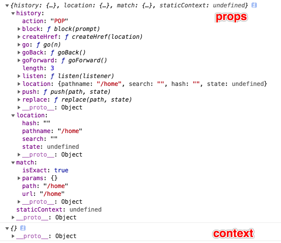

# 简单实现 react-router-dom 

## 安装依赖

> 实际项目中建议用 create-react-app 脚手架搭建项目，学习期间建议手撸。

```bash
$ npm i webpack webpack-cli webpack-dev-server html-webpack-plugin less less-loader css-loader style-loader babel-loader @babel/core @babel/preset-env @babel/preset-react -D
$ npm i react react-dom react-router-dom -S
```

Package | 说明
-- | --
react-router | 核心库
react-router-dom | 浏览器使用
react-router-native | React Native 使用

## 基础说明

- router 
    - 路由容器组件（现在不限制一个根元素了）
    - 有两种模式可选
        - BrowserRouter ：浏览器自带的 H5 API ，restful风格，需要后台配合
        - HashRouter ：使用 hash 方式进行路由，路径后均有 # 
- route 
    - 单条路由规则，存在多个
        - <Route path="/" component={Home}>
    - 渲染时给组件传入 props 如下：
        
- 渲染过程
    - 渲染时会先取当前路径(HashRouter 时为 location.hash)，然后跟 path 匹配
    - 匹配的上就显示 component 指定的组件，不能匹配就不显示

## 开始实现

思路： HashRouter 不处理 UI 显示，只负责提供一些变量(如，当前路径)给 Route ，由 Route 进行路径匹配来决定是否渲染指定 component UI 组件。

过程：按照上面的 props 截图，逐个实现。

贴士：node_modules 中的包是编译后的 ES5 语法，所以可以通过查看[react-router ESM](https://github.com/ReactTraining/react-router/tree/master/packages/react-router/modules)、[react-router-dom ESM](https://github.com/ReactTraining/react-router/tree/master/packages/react-router-dom/modules) 比对学习。

### 1. 使用 context 传递数据及基础渲染

思路：需要的 props 参数并未显式传递，所以通过 context 上下文进行传递。 Router 作为提供者， Route 作为消费者。

```javascript
// context.js
export default React.createContext({});
```

```javascript
// HashRouter.js
render() {
    return (
        <ThemeContext.Provider value={{location: {pathname: window.location.hash.slice(1)}}}>
            {this.props.children}
        </ThemeContext.Provider>
    )
}
```

```javascript
// Route.js
render() {
    // 由于小写会被判定为 HTML 节点，所以要转成首字母大写
    let { path, component: Component } = this.props;
    return (
        <ThemeContext.Consumer>
            {
                context => {
                    if(context.location.pathname == path) {
                        return <Component {...context} />;
                    } else {
                        return null;
                    }
                }
            }
        </ThemeContext.Consumer>
    )
}
```

### 2、实现 Link 标签更新 UI 渲染

查看原 router 库的最终渲染结果，直观表现就是一个 a 标签，按照该表现进行 render , ~~<a href={'#' + this.props.to}>{this.props.children}</a>~~。渲染正常，但点击 Link 后，虽然路由对应更改，但是并没有触发组件渲染更新，所以路由切换并不是由 a 标签的原生表现实现的。

内部绑定了 click 事件，并拦截了默认操作，来实现功能定制。调用 context.history.push 方法，来修改路由，并通过 setState 触发更新。

### 3、嵌套路由

简单实现就是判断路由的时候，增加一个判断条件 pathname.startsWith(path) ，或关系。

注：后面会用正则进行前缀匹配，暂时先这么处理。

### 4、路由参数

思路：回忆 express 路由实现，最终就是`正则匹配`路由，获取并缓存路由参数 key ，匹配成功时对应填充 value。
eg:
```javascript
var props = {
    match: {
        url: '/user/detail/1',
        path: '/user/detail/:id',
        params: {id:1}
    }
}
```

```bash
$ npm i path-to-regexp -S
```

```javascript
// Route.js

let keys = [];
// 使用 switch 时，要动态创建 regexp
let regexp = pathToRegexp(path, keys, { end: false }); // 只匹配前缀

let {location: { pathname }} = context;
// 匹配路由，获取 params 
let rst = pathname.match(regexp);

if(rst) {
    // 匹配成功的时候才更新 keys
    keys = keys.map(key => key.name);

    let [url, ...values] = rst;
    let params = keys.reduce((memo, key, index) => {
        memo[key] = values[index];
        return memo;
    }, {});
    
    context.match = {
        url,
        path,
        params
    };

    return <Component {...context} />;
} else {
    return null;
}
```

### 5、Switch 组件

效果：Route 组件只要匹配地址成功的都会渲染（可能会渲染多个），但 Switch 组件只渲染一个路由（即使可以匹配多个）。

分析：也是一个组件，替内部的 Route 做匹配抉择，只要匹配成功就终止。

实现：
```javascript
for(let i = 0; i < children.length; i++) {
    let child = children[i];
    if(pathToRegexp(child.props.path, [], {end: false}).test(pathname)) {
        return child ;
    }
}
return null;
```

### 6、Redirect 重定向组件

该组件并不是一个渲染组件，而是一个执行重定向操作的组件。所以 render 返回 null，主要操作在 push 方法的调用。

```javascript
// Redirect.js
<ThemeContext.Consumer>
    { context => <Lifecycle onMount = {() => context.history.push(this.props.to.pathname)} />}
</ThemeContext.Consumer>
```

实际应用，我们还可能会传递其他数据，比如用于登陆成功后重定向回源路由，那么约定除了 `pathname` 以外，还有一个 `state` 对象，用于存储目标路径以外的数据。数据内容没有要求。此时，上面的传递方式有局限性，所以需要修改 Redirect 组件的传递数据，当然作为接收方的 push 方法也要对应增加处理能力。

此外，state 也需要存储在 context.location 中，以便其他组件可以方便获取。

```javascript
// HashRouter.js
push(path) {
    let state = {};
    if(typeof path == 'object') {
        state = path.state;
        path = path.pathname;
    }
    window.location.hash = path;
    this.setState({
        location: Object.assign({}, this.state.location, {
            pathname: path,
            state
        })
    });
}
```